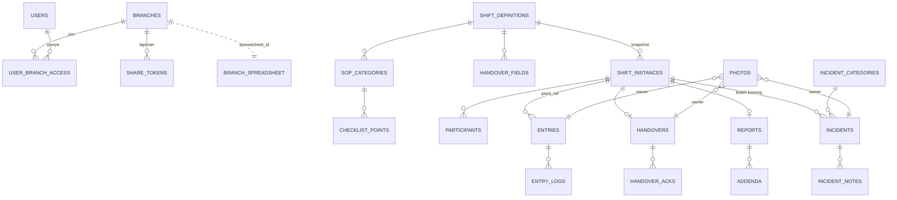

# Database Schema (Google Sheets) — checklist-shift

Acuan: `PRD.md` (bagian 10, model data) dan `TRD.md` (bagian 5-6). Dokumen ini adalah kontrak antara kode `apps/api` dan isi spreadsheet. Skema Zod di `packages/shared` harus identik dengan dokumen ini.

## 1. Prinsip

1. **Dua lapis spreadsheet:** satu *registry* global + satu *spreadsheet per cabang*. Tambah cabang = tambah baris di `Branches`.
2. **Hanya API yang menulis** (service account). Tidak ada edit manual.
3. **Tidak ada hapus/urut/sisip baris** (BR-40). Akibatnya nomor baris stabil, sehingga peta `id -> baris` aman di-cache.
4. **Tab volume tinggi dipecah per bulan** (`Entries_YYYY-MM`, dst.).
5. **Kode membaca kolom berdasarkan nama header, bukan urutan.** Kolom baru hanya ditambah di ujung kanan.
6. **Sheets tidak menegakkan constraint.** Keunikan, relasi, dan status ditegakkan oleh API di bawah lock Redis, lalu ditulis atomik (bagian 10).
7. **Semua cache dapat dibangun ulang dari Sheets.** Yang tidak dapat dibangun ulang hanya lock, sesi, dan rate limit (bersifat sementara).

## 2. Konvensi

### 2.1 Tipe kolom

| Tipe | Format di sel | Catatan |
|---|---|---|
| `id` | ULID 26 karakter, teks | Dibuat di aplikasi. Selalu **kolom A**. |
| `string` | teks | Maks 5.000 karakter kecuali disebut lain |
| `text` | teks panjang | Maks 20.000 karakter |
| `int`, `float` | angka | |
| `bool` | `TRUE` / `FALSE` (boolean native) | |
| `datetime` | ISO 8601 UTC, mis. `2026-10-03T01:15:30.123Z` | Disimpan sebagai teks |
| `date` | `YYYY-MM-DD` | Tanggal menurut zona waktu cabang |
| `time` | `HH:mm` | Jam dinding zona cabang |
| `month` | `YYYY-MM` | Untuk penentu tab bulanan |
| `json` | JSON minified | Maks 45.000 karakter (batas sel 50.000) |
| `enum` | teks dari daftar tetap (bagian 6) | Divalidasi Zod |
| `hash` | hex SHA-256 (64 karakter) | |
| `X?` | boleh kosong | Sel kosong = null |

### 2.2 Aturan penulisan
- Tulis dengan `valueInputOption=RAW`; baca dengan `valueRenderOption=UNFORMATTED_VALUE`. Ini mencegah Sheets mengubah teks menjadi tanggal/angka/formula.
- Semua kolom bertipe teks diberi format **Plain text** saat tab dibuat.
- Ekspor CSV wajib menetralkan sel yang diawali `=`, `+`, `-`, `@` (awali dengan `'`) agar aman dibuka di Excel.
- Baris 1 = header, dibekukan. Baris data mulai baris 2.
- Tab baru dibuat dengan grid minimal (jumlah kolom = jumlah header, baris awal 1.000) agar tidak menghabiskan jatah 10 juta sel.

### 2.3 Kolom standar
Kecuali disebut lain, setiap tab memiliki di ujung kanan: `created_at` (datetime), `updated_at` (datetime). Tab yang diedit di tempat memiliki juga `version` (int, naik 1 setiap update; dipakai untuk deteksi tulis ganda). Tab yang dapat dinonaktifkan memiliki `is_active` (bool).

### 2.4 Urutan kolom tab anak
Pada semua tab anak berpartisi bulan, kolom **B = `shift_instance_id`** (atau induk utamanya). Ini memungkinkan pemindaian murah `B:B` untuk membangun indeks baris.

## 3. Diagram Relasi



`ENTRIES.point_ref` mengacu ke butir di **snapshot** shift, bukan langsung ke `ChecklistPoints`.

## 4. Registry (spreadsheet global)

Disimpan di `REGISTRY_SPREADSHEET_ID`. Ukurannya kecil. Di-cache di Redis.

### 4.1 `Branches`
| Kolom | Tipe | Keterangan |
|---|---|---|
| `id` | id | `branch_id` |
| `name` | string | |
| `code` | string | Unik, huruf besar tanpa spasi (mis. `BDG01`); dipakai di nomor laporan |
| `address` | string? | |
| `timezone` | string | IANA, default `Asia/Jakarta` |
| `spreadsheet_id` | string | ID spreadsheet cabang aktif |
| `schema_version` | int | Versi skema spreadsheet cabang (sinkron dengan `_meta`) |
| `is_active` | bool | Nonaktif = tidak bisa buka shift baru |
| `created_at`, `updated_at` | datetime | |

Unik: `code`, `spreadsheet_id`.

### 4.2 `BranchArchives` (dibuat saat dibutuhkan, lihat 12.3)
| Kolom | Tipe | Keterangan |
|---|---|---|
| `id` | id | |
| `branch_id` | id | |
| `from_month`, `to_month` | month | Rentang tab bulanan yang dipindahkan |
| `spreadsheet_id` | string | Spreadsheet arsip (baca saja) |
| `created_at` | datetime | |

### 4.3 `Users`
| Kolom | Tipe | Keterangan |
|---|---|---|
| `id` | id | |
| `name` | string | |
| `username` | string | Unik, huruf kecil, tanpa spasi |
| `pin_hash` | string | argon2 dengan `PIN_PEPPER`. **Kolom paling sensitif.** |
| `role` | enum | `admin` / `petugas` |
| `is_active` | bool | |
| `must_change_pin` | bool | TRUE untuk PIN awal/reset (AUTH-07) |
| `locked_until` | datetime? | Diisi saat terkunci |
| `last_login_at` | datetime? | |
| `pin_changed_at` | datetime? | |
| `created_at`, `updated_at`, `version` | | |

Penghitung percobaan PIN salah **disimpan di Redis** (`pinfail:{userId}`), bukan di sheet, agar tidak menulis ke Sheets pada tiap percobaan. Sheet hanya menyimpan `locked_until` saat akun terkunci dan saat dibuka.

### 4.4 `UserBranchAccess`
| Kolom | Tipe | Keterangan |
|---|---|---|
| `id` | id | |
| `user_id` | id | |
| `branch_id` | id | |
| `granted_by` | id | admin pemberi akses |
| `is_active` | bool | Mencabut akses = `FALSE` (bukan hapus baris) |
| `created_at`, `updated_at` | datetime | |

Unik: (`user_id`, `branch_id`). Pencabutan lalu pemberian ulang mengaktifkan kembali baris yang sama.

### 4.5 `IncidentCategories`
`id`, `name` (unik), `sort_order` (int), `is_active`, `created_at`, `updated_at`.

### 4.6 `Settings`
| Kolom | Tipe | Keterangan |
|---|---|---|
| `key` | string | Unik; kolom A |
| `value` | string | Nilai dalam teks |
| `value_type` | enum | `int` / `bool` / `string` / `text` |
| `updated_by` | id? | |
| `updated_at` | datetime | |

Kunci dan nilai bawaan:

| key | Default | Sumber |
|---|---|---|
| `tolerance_default_minutes` | 15 | PRD 7.11 |
| `pin_max_attempts` | 5 | PRD 7.11 |
| `pin_lock_minutes` | 15 | PRD 7.11 |
| `session_days` | 30 | PRD 7.11 |
| `share_token_days` | 30 | PRD 7.11 |
| `incident_link_window_hours` | 4 | PRD 7.11 |
| `photo_max_count` | 5 | PRD 7.11 |
| `photo_max_size_kb` | 1024 | Usulan |
| `photo_retention_days` | 0 (tanpa batas) | Usulan, TBD |
| `public_show_photos` | TRUE | Usulan |
| `pin_block_weak` | TRUE | Usulan (tolak `123456`, `000000`, dst.) |
| `whatsapp_template` | teks dengan variabel `{cabang} {tanggal} {shift} {pj} {ringkasan} {tautan}` | PRD 7.11 |

### 4.7 `ShareTokens`
| Kolom | Tipe | Keterangan |
|---|---|---|
| `id` | id | Bagian publik token |
| `secret_hash` | hash | SHA-256 dari bagian rahasia token |
| `branch_id` | id | |
| `report_id` | id | |
| `shift_instance_id` | id | |
| `expires_at` | datetime | |
| `revoked_at` | datetime? | |
| `revoked_by` | id? | |
| `created_by` | id | |
| `created_at` | datetime | |

Format token di URL: `{id}.{secret}` (secret acak 32 byte, base64url). Pencarian: ambil baris berdasarkan `id` lewat peta baris, lalu bandingkan hash secret. Tidak perlu memindai tabel.

### 4.8 `PushSubscriptions`
`id`, `user_id`, `endpoint`, `p256dh`, `auth`, `device_info` (string?), `revoked_at` (datetime?), `created_at`. Unik: `endpoint`.

### 4.9 `NotificationPrefs`
`id`, `user_id`, `type` (enum jenis notifikasi), `enabled` (bool), `updated_at`. Unik: (`user_id`, `type`). Tidak ada baris = bawaan aktif.

### 4.10 `AuditLog_Global`
Aksi lintas cabang: akun, akses, cabang, pengaturan, kategori incident, token. Struktur dan hash chain: bagian 11.

## 5. Spreadsheet Cabang

### 5.1 `_meta`
Pasangan `key` / `value`:

| key | Isi |
|---|---|
| `schema_version` | int |
| `branch_id` | harus sama dengan registry (diverifikasi saat terhubung) |
| `created_at`, `last_migrated_at` | datetime |
| `last_closed_shift_id` | id shift terakhir berstatus Ditutup/Ditutup paksa (bukan uji). Dasar "shift sebelumnya" untuk handover (6.3.1 PRD). Diperbarui saat tutup shift. |
| `last_summary_at` | datetime, terakhir cron `Summary` selesai |
| `approx_cell_count` | int, diisi cron (lihat 12.3) |

### 5.2 Template

**`ShiftDefinitions`**
| Kolom | Tipe | Keterangan |
|---|---|---|
| `id` | id | |
| `name` | string | |
| `start_time`, `end_time` | time | |
| `crosses_midnight` | bool | |
| `sort_order` | int | |
| `is_active` | bool | |
| `created_at`, `updated_at`, `version` | | |

**`SopCategories`**: `id`, `shift_definition_id`, `name`, `sort_order`, `is_active`, `created_at`, `updated_at`, `version`.

**`ChecklistPoints`**
| Kolom | Tipe | Keterangan |
|---|---|---|
| `id` | id | |
| `sop_category_id` | id | |
| `title` | string | |
| `instruction` | text? | |
| `input_type` | enum | `centang` / `foto` / `teks` / `angka` / `ok_tidak_ok` |
| `is_required` | bool | |
| `target_time` | time? | Kosong = tanpa waktu |
| `tolerance_minutes` | int? | Kosong = pakai `tolerance_default_minutes` |
| `active_days` | string? | Hari berlaku, mis. `1,3,5` (1=Senin ... 7=Minggu). Kosong = setiap hari |
| `number_min`, `number_max` | float? | Rentang normal (hanya `angka`) |
| `sort_order` | int | |
| `is_active` | bool | |
| `created_at`, `updated_at`, `version` | | |

**`HandoverFields`**: `id`, `shift_definition_id`, `label`, `field_type` (enum: `teks` / `angka` / `pilihan` / `ya_tidak`), `options` (json?, array string untuk `pilihan`), `is_required`, `sort_order`, `is_active`, `created_at`, `updated_at`, `version`.

Catatan: `branch_id` tidak ada di tab cabang karena sudah tersirat oleh file. Saat "Salin dari cabang lain", API menulis `id` baru dan menjaga relasi.

### 5.3 `ShiftInstances` (induk operasional)
| Kolom | Tipe | Keterangan |
|---|---|---|
| `id` | id | |
| `shift_definition_id` | id | |
| `shift_date` | date | Tanggal **dibuka**, zona cabang (BR-02) |
| `tab_month` | month | = bulan `shift_date`; menentukan tab anak |
| `status` | enum | `berjalan` / `ditutup` / `ditutup_paksa` / `void` |
| `pj_user_id` | id | |
| `opened_by` | id | Pembuka (admin bila "buka atas nama") |
| `opened_at` | datetime | |
| `opened_outside_hours` | bool | BR-04 |
| `closed_at` | datetime? | |
| `closed_by` | id? | |
| `close_type` | enum? | `normal` / `paksa` |
| `force_close_reason` | string? | Wajib bila `paksa` |
| `is_incomplete` | bool | TRUE bila tutup paksa dengan item wajib belum selesai (BR-34) |
| `no_incident_confirmed` | bool | PJ menegaskan "tidak ada incident" (BR-33) |
| `void_reason`, `void_by`, `void_at` | string?, id?, datetime? | |
| `is_test` | bool | Mode pratinjau admin (ADM-SEC-05) |
| `snapshot_encoding` | enum | `gzip_b64` |
| `template_snapshot` | string | Snapshot terkompresi, atau `ref:{snapshot_id}` bila dipecah (bagian 8) |
| `snapshot_hash` | hash | SHA-256 snapshot terdekompresi (kanonik) |
| `created_at`, `updated_at`, `version` | | |

Kunci unik logis (non-void): `shift_definition_id | shift_date | is_test`. Dijaga oleh lock (BR-01).

### 5.4 Tab sedang (tidak dipartisi)

**`Participants`**: `id`, `shift_instance_id`, `user_id`, `first_action_at` (datetime), `first_action_type` (enum: `buka_shift` / `centang` / `isi` / `skip` / `incident` / `saya_bertugas`), `created_at`. Unik: (`shift_instance_id`, `user_id`).
> Asumsi: pembuka shift (PJ) langsung tercatat sebagai peserta dengan `buka_shift`. PRD BR-07 menyebut "aksi pertama"; membuka shift dianggap aksi. Konfirmasi.

**`Reports`**
| Kolom | Tipe | Keterangan |
|---|---|---|
| `id` | id | |
| `shift_instance_id` | id | Unik (satu laporan per shift) |
| `report_number` | string | `{branch.code}-{YYYYMMDD}-{nn}`, `nn` urutan harian dibuat di bawah lock tutup |
| `generated_by` | id | |
| `generated_at` | datetime | |
| `is_locked` | bool | |
| `summary_stats` | json | Angka ringkas dan penanda (di luar jam, ada skip, tidak lengkap) |
| `content_hash` | hash | Pembuktian isi saat ditutup (bagian 11.3) |
| `unlock_count` | int | Jumlah buka kunci darurat |
| `last_unlocked_at`, `last_unlocked_by` | datetime?, id? | |
| `created_at`, `updated_at`, `version` | | |

**`Addenda`**: `id`, `report_id`, `author_id`, `note` (text), `created_at`. Tidak ada `updated_at`; addendum tidak dapat diubah.

**`Summary`** (agregat harian untuk dashboard dan statistik, diisi cron)
| Kolom | Tipe | Keterangan |
|---|---|---|
| `id` | id | |
| `summary_date` | date | |
| `shift_definition_id` | id | |
| `shifts_total`, `shifts_closed_normal`, `shifts_closed_forced`, `shifts_void` | int | `void` terpisah, tidak dihitung ke statistik |
| `required_total`, `required_done`, `required_skipped` | int | |
| `timed_on_time`, `timed_early`, `timed_late` | int | |
| `incidents_total`, `incidents_open` | int | |
| `incidents_by_category` | json | `{category_id: n}` |
| `handovers_read` | int | |
| `participants_count` | int | |
| `computed_at` | datetime | |

Unik: (`summary_date`, `shift_definition_id`). Upsert idempoten. Shift `is_test` dikecualikan.

**`Snapshots`** (hanya bila snapshot terlalu besar): `id`, `shift_instance_id`, `part_no` (int), `chunk` (string ≤ 45.000), `created_at`.

**`IncidentIndex`** (indeks kecil non-partisi; menjawab "incident open" lintas bulan tanpa memindai banyak tab)
`incident_id` (kolom A), `tab_month`, `status`, `category_id`, `shift_instance_id?`, `outside_shift`, `reported_at`, `is_test`, `updated_at`. Ditulis bersamaan dengan `Incidents_*` dalam satu batch.

### 5.5 Tab berpartisi bulan
Penentu bulan: `ShiftInstances.tab_month` untuk `Entries`, `EntryLogs`, `Handovers`, `HandoverAcks`, `Photos` milik shift; `Incidents.tab_month` untuk incident dan anak-anaknya. Nama tab: `{Nama}_{YYYY-MM}`. Tab dibuat otomatis oleh API saat pertama dibutuhkan (di bawah lock).

**`Entries_YYYY-MM`** (satu baris per butir per shift, **dibuat saat aksi pertama pada butir itu**, tidak dibuat saat shift dibuka; tidak ada baris = `belum`)
| Kolom | Tipe | Keterangan |
|---|---|---|
| `id` | id | |
| `shift_instance_id` | id | **Kolom B** |
| `point_ref` | id | `id` butir di snapshot |
| `state` | enum | `belum` / `selesai` / `skip` (kembali `belum` bila dibatalkan) |
| `value` | string? | Centang: `TRUE`; angka: bilangan; OK/Tidak OK: `OK`/`TIDAK_OK`; teks: isi |
| `out_of_range` | bool | Angka di luar rentang |
| `photo_ids` | json? | Array `Photos.id` (denormalisasi untuk baca cepat) |
| `completed_by` | id? | |
| `completed_at` | datetime? | Waktu server terkoreksi (BR-23) |
| `timing_label` | enum? | `tepat_waktu` / `lebih_awal` / `terlambat`; kosong bila tanpa waktu target |
| `timing_delta_minutes` | int? | Selisih terhadap target (negatif = lebih awal) |
| `skip_reason` | string? | Wajib bila `skip` |
| `created_at`, `updated_at`, `version` | | |

Unik: (`shift_instance_id`, `point_ref`). Kunci peta: `{shift_instance_id}|{point_ref}`.

**`EntryLogs_YYYY-MM`** (append-only; riwayat setiap aksi)
| Kolom | Tipe | Keterangan |
|---|---|---|
| `id` | id | |
| `shift_instance_id` | id | **Kolom B** |
| `entry_id` | id? | Kosong bila aksi kalah dan baris belum ada |
| `point_ref` | id | |
| `action` | enum | `selesai` / `batal` / `skip` / `ubah_nilai` |
| `outcome` | enum | `diterima` / `ditolak_kalah` (BR-12) |
| `user_id` | id | Pelaku |
| `winner_user_id` | id? | Terisi bila `ditolak_kalah` |
| `prev_state`, `new_state` | enum? | |
| `value` | string? | |
| `note` | string? | Alasan skip/batal |
| `client_action_id` | string | Kunci idempotensi dari klien (ULID); aksi ulang hasil retry diabaikan |
| `client_at` | datetime? | Jam perangkat (informasi saja) |
| `at` | datetime | Waktu server terkoreksi; **sumber kebenaran** |
| `created_at` | datetime | |

**`Handovers_YYYY-MM`**: `id`, `shift_instance_id` (B, unik), `values` (json: `{handover_field_id: nilai}`), `free_text` (text?), `photo_ids` (json?), `submitted_by`, `submitted_at`, `created_at`, `updated_at`.

**`HandoverAcks_YYYY-MM`**: `id`, `handover_id`, `reading_shift_instance_id` (B), `user_id`, `read_at`, `created_at`. Unik: (`handover_id`, `reading_shift_instance_id`). Bulan tab = bulan shift pembaca.

**`Photos_YYYY-MM`**
| Kolom | Tipe | Keterangan |
|---|---|---|
| `id` | id | |
| `shift_instance_id` | id? | **Kolom B**; kosong untuk incident di luar shift |
| `owner_type` | enum | `entry` / `handover` / `incident` |
| `owner_id` | id | |
| `storage` | enum | `drive` / `blob` (TBD) |
| `file_ref` | string | ID file Drive atau pathname Blob. Bukan URL publik. |
| `mime`, `size_bytes`, `width`, `height` | string, int, int?, int? | |
| `sort_order` | int | |
| `status` | enum | `pending` / `uploaded` / `purged` |
| `uploaded_by` | id | |
| `uploaded_at`, `purged_at` | datetime, datetime? | `purged` = file dihapus sesuai retensi; baris tetap |
| `created_at` | datetime | |

Menggantikan `IncidentPhoto` dan field `photo_urls` di PRD. Foto diakses lewat route API yang memeriksa akses cabang.

**`Incidents_YYYY-MM`** (bulan = bulan `reported_at` menurut zona cabang)
| Kolom | Tipe | Keterangan |
|---|---|---|
| `id` | id | |
| `shift_instance_id` | id? | **Kolom B**; kosong = berdiri sendiri |
| `tab_month` | month | |
| `category_id` | id | Mengacu ke registry |
| `description` | text | **Tidak dapat diubah** (BR-41) |
| `occurred_at` | datetime | |
| `reported_by` | id | |
| `reported_at` | datetime | |
| `status` | enum | `open` / `selesai` |
| `outside_shift` | bool | |
| `link_source` | enum | `otomatis` / `admin` / `none` |
| `linked_by`, `linked_at` | id?, datetime? | Penautan oleh admin kemudian |
| `source_entry_id` | id? | Bila dibuat dari butir yang di-skip/gagal (IN-08) |
| `severity` | enum? | `rendah` / `sedang` / `tinggi` (opsional) |
| `status_changed_by`, `status_changed_at` | id?, datetime? | |
| `is_test` | bool | |
| `created_at`, `updated_at`, `version` | | |

**`IncidentNotes_YYYY-MM`**: `id`, `incident_id` (B), `author_id`, `author_role` (enum), `note` (text), `created_at`. Bulan tab = bulan incident induknya.

**`AuditLog_YYYY-MM`**: struktur sama dengan global (bagian 11) ditambah `shift_instance_id?`. Mencakup aksi admin pada cabang (perubahan template, tutup paksa, ganti PJ, void, addendum, buka kunci, tautan incident).

## 6. Daftar Enum

| Enum | Nilai |
|---|---|
| role | `admin`, `petugas` |
| shift status | `berjalan`, `ditutup`, `ditutup_paksa`, `void` |
| close_type | `normal`, `paksa` |
| input_type | `centang`, `foto`, `teks`, `angka`, `ok_tidak_ok` |
| entry state | `belum`, `selesai`, `skip` |
| timing_label | `tepat_waktu`, `lebih_awal`, `terlambat` |
| entry action | `selesai`, `batal`, `skip`, `ubah_nilai` |
| outcome | `diterima`, `ditolak_kalah` |
| handover field_type | `teks`, `angka`, `pilihan`, `ya_tidak` |
| incident status | `open`, `selesai` |
| link_source | `otomatis`, `admin`, `none` |
| severity | `rendah`, `sedang`, `tinggi` |
| photo owner_type | `entry`, `handover`, `incident` |
| photo status | `pending`, `uploaded`, `purged` |
| storage | `drive`, `blob` |
| participant first_action_type | `buka_shift`, `centang`, `isi`, `skip`, `incident`, `saya_bertugas` |
| notification type | `handover_baru`, `item_jatuh_tempo`, `ganti_pj`, `tutup_paksa`, `shift_tidak_ditutup`, `shift_tidak_dibuka`, `incident_baru`, `shift_ditutup`, `aksi_darurat` |

## 7. Kunci Unik dan Lock

| Aturan | Kunci logis | Lock Redis |
|---|---|---|
| BR-01 satu shift non-void | `shift_definition_id\|shift_date\|is_test` | `lock:shift:{branch}:{def}:{date}:{test}` |
| BR-12 pemenang pertama | `shift_instance_id\|point_ref` | `lock:entry:{shiftId}:{pointRef}` |
| Tutup shift | `shift_instance_id` | `lock:close:{shiftId}` |
| Rantai audit | per tab audit | `lock:audit:{scope}` |
| Buat tab bulanan | `{spreadsheet}\|{tab}` | `lock:tab:{spreadsheet}:{tab}` |
| Username unik | `username` | `lock:user:{username}` |
| Kode cabang unik | `code` | `lock:branch:{code}` |
| Peserta unik | `shift_instance_id\|user_id` | di bawah lock aksi yang menyebabkannya |

Aturan lock: nilai lock acak (token pemilik), TTL 10 detik, dilepas dengan perbandingan token. Jika Redis tidak tersedia, operasi atomik **ditolak** (fail closed).

## 8. Format Snapshot

`ShiftInstances.template_snapshot` = JSON di bawah, dikanonisasi (urutan kunci tetap), digzip, lalu base64. `snapshot_hash` dihitung dari JSON kanonik sebelum kompresi.

```json
{
  "v": 1,
  "shift": {"id": "...", "name": "Opening", "start_time": "07:00", "end_time": "15:00", "crosses_midnight": false},
  "settings": {"tolerance_default_minutes": 15, "timezone": "Asia/Jakarta"},
  "categories": [
    {"id": "...", "name": "Kebersihan", "sort_order": 1,
     "points": [
       {"point_ref": "<ChecklistPoints.id>", "title": "...", "instruction": "...",
        "input_type": "angka", "is_required": true, "target_time": "07:30",
        "tolerance_minutes": 15, "active_days": "1,2,3,4,5",
        "number_min": 1.0, "number_max": 5.0, "sort_order": 1}
     ]}
  ],
  "handover_fields": [
    {"id": "...", "label": "Kas awal", "field_type": "angka", "options": null, "is_required": true, "sort_order": 1}
  ]
}
```

- Butir yang tidak berlaku pada hari itu (`active_days`) **tidak masuk** snapshot.
- Jika hasil base64 > 45.000 karakter: pecah ke tab `Snapshots` per 45.000 karakter dan isi `template_snapshot` dengan `ref:{snapshot_id}` (`snapshot_id` = `shift_instance_id`).
- Butir/kategori nonaktif tetap bisa dirujuk oleh laporan lama karena snapshot disimpan utuh (ADM-CK-05).

## 9. Kunci Redis

| Kunci | Isi | TTL |
|---|---|---|
| `reg:{tab}` | Salinan tab registry | 60 dtk, invalidasi saat admin ubah |
| `hdr:{spreadsheetId}:{tab}` | Peta nama header -> indeks kolom | 1 jam |
| `rowmap:{spreadsheetId}:{tab}` | Hash `id -> nomor baris` | Tanpa TTL, dibangun ulang dari kolom A |
| `rows:{spreadsheetId}:{tab}:{shiftId}` | Daftar nomor baris milik satu shift | Tanpa TTL, dibangun ulang dari kolom B |
| `shift:{branch}:{def}:{date}` | `shift_instance_id` aktif | Sampai shift ditutup |
| `idem:{clientActionId}` | Hasil aksi (dedupe retry) | 7 hari |
| `sess:{userId}:{sessionId}` | Metadata sesi | Sesuai `session_days` |
| `sess:revoked:{userId}` | Waktu pencabutan sesi (JWT sebelum waktu ini ditolak) | Sesuai `session_days` |
| `pinfail:{userId}` | Penghitung PIN salah | `pin_lock_minutes` |
| `rl:{aksi}:{ip atau username}` | Rate limit | Menurut aturan |
| `notif:{userId}` | Daftar notifikasi dalam aplikasi (maks 200) | 30 hari |
| `audit:head:{scope}` | Hash terakhir rantai | Tanpa TTL |
| `lock:*` | Lock (bagian 7) | 10 dtk |

Verifikasi cache: setiap tulis membaca sel `A{row}` pada batch yang sama dan memastikan `id` cocok. Jika tidak cocok (baris bergeser karena campur tangan manual), peta dibangun ulang dan operasi diulang satu kali.

## 10. Resep Transaksi

Semua resep: **ambil lock -> baca keadaan -> validasi -> satu `spreadsheets.batchUpdate` -> lepas lock**. `spreadsheets.batchUpdate` bersifat atomik: semua permintaan di dalamnya berlaku atau tidak satu pun. Gunakan `appendCells`/`updateCells` lintas tab dalam satu panggilan.

1. **Buka shift** (BR-01): lock `shift` -> cek kunci unik (cache `shift:*`, lalu `ShiftInstances` bila cache kosong) -> jika sudah ada: kembalikan "bergabung". Jika belum: bangun snapshot, `append` `ShiftInstances` + `Participants` (PJ) -> perbarui cache `shift:*`.
2. **Aksi checklist** (BR-12): cek `idem:{clientActionId}` -> lock `entry` -> baca baris `Entries` (peta baris) -> bila `state` sudah `selesai`/`skip` oleh orang lain dan aksi adalah selesai: tulis hanya `EntryLogs` dengan `outcome=ditolak_kalah` dan kembalikan "sudah diselesaikan oleh X". Jika diterima: `update`/`append` `Entries` + `append` `EntryLogs` + `append` `Participants` bila peserta baru -> simpan `idem`.
3. **Foto:** unggah file ke penyimpanan dahulu (`Photos.status=pending`), lalu tulis `Photos` + perbarui `photo_ids` pada induk dalam satu batch dengan status `uploaded`. Foto yatim (pending > 24 jam) dibersihkan cron.
4. **Tutup shift** (BR-30, BR-31): lock `close` -> pastikan `status=berjalan` dan pemanggil = PJ -> validasi item wajib dan handover -> hitung `report_number` dan `content_hash` -> satu batch: update `ShiftInstances` (status, `closed_*`), `append` `Reports`, update `_meta.last_closed_shift_id`.
5. **Incident:** `append` `Incidents_*` + `IncidentIndex` (+ `Photos`) dalam satu batch. Penautan otomatis memakai `incident_link_window_hours` terhadap `closed_at`.
6. **Tulis audit:** lock `audit` -> ambil `audit:head` -> hitung `hash` -> `append`. Dilakukan di batch yang sama dengan perubahan yang diaudit bila di spreadsheet yang sama.
7. **Operasi admin pada laporan terkunci** (addendum, buka kunci): selalu menulis `AuditLog` dan, untuk buka kunci, memperbarui `Reports.unlock_count`.

Kegagalan:
- Respons Sheets hilang tetapi tulis berhasil: retry memakai `client_action_id` yang sama sehingga tidak ganda (dicek di `idem:*` dan, bila Redis kosong, di `EntryLogs`).
- Proses mati di tengah: tidak ada tulis sebagian karena batch atomik; lock kedaluwarsa sendiri.
- Penegakan status: setiap API tulis menolak bila `ShiftInstances.status` bukan `berjalan` (kecuali operasi admin yang diizinkan).

## 11. Audit Log dan Integritas

### 11.1 Struktur `AuditLog_Global` / `AuditLog_YYYY-MM`
| Kolom | Tipe | Keterangan |
|---|---|---|
| `id` | id | |
| `seq` | int | Berurutan dalam satu tab (dari `audit:head`) |
| `at` | datetime | Waktu server |
| `actor_id` | id | |
| `action` | string | Mis. `shift.tutup_paksa`, `akun.reset_pin`, `template.ubah` |
| `object_type`, `object_id` | string, id? | |
| `branch_id` | id? | |
| `shift_instance_id` | id? | Hanya audit cabang |
| `before`, `after` | json? | Nilai sebelum/sesudah. **Tidak boleh memuat `pin_hash`.** |
| `reason` | string? | Wajib untuk aksi sensitif |
| `prev_hash` | hash | `hash` baris sebelumnya (baris pertama tab: hash terakhir tab bulan lalu; awal rantai: 64 nol) |
| `hash` | hash | Lihat 11.2 |

### 11.2 Hash chain
`hash = SHA-256( prev_hash + "|" + canonicalJSON({seq, at, actor_id, action, object_type, object_id, branch_id, shift_instance_id, before, after, reason}) )`

Cron mingguan memverifikasi seluruh rantai (per cabang dan global). Ketidakcocokan memicu notifikasi admin `aksi_darurat`. Ini **mendeteksi** perubahan manual; tidak mencegahnya.

### 11.3 `Reports.content_hash`
SHA-256 dari JSON kanonik: bidang inti `ShiftInstances` (tanpa `updated_at`/`version`), `snapshot_hash`, seluruh `Entries` shift (urut `point_ref`), `Handovers`, daftar `Participants`, dan daftar `incident_id` yang tertaut **saat penutupan**. Incident yang ditautkan admin setelahnya, serta addendum, tidak termasuk (ditampilkan dengan keterangan "ditautkan kemudian"). Verifikasi dapat dijalankan admin pada halaman laporan.

## 12. Kapasitas dan Kuota

### 12.1 Batas Google
- **10 juta sel per spreadsheet** (termasuk sel kosong dalam grid).
- **50.000 karakter per sel.**
- Kuota Sheets API: sekitar **60 baca/menit dan 60 tulis/menit per pengguna per project**, dan 300/menit per project. **Satu service account = satu pengguna**, sehingga seluruh sistem (semua cabang) hanya mendapat ~60 tulis/menit. Verifikasi angka terbaru di konsol Google Cloud sebelum Fase 1.

### 12.2 Strategi (berurutan)
1. **Batch:** satu aksi pengguna = maksimal satu panggilan tulis (`spreadsheets.batchUpdate`). Baca dilayani cache bila memungkinkan.
2. **Kumpulan service account (pool):** 3-5 service account, dipilih bergilir per spreadsheet; kuota dihitung per pengguna sehingga kapasitas naik, dibatasi 300/menit per project. Semua diberi akses Editor ke folder root.
3. **Penggabungan tulis (coalescing):** aksi dalam jendela singkat (usulan 2 detik) pada spreadsheet yang sama digabung ke satu batch.
4. **Hanya bila uji beban gagal:** *write-behind* dengan antrean Redis. Keputusan BR-12 dibuat di Redis, ditulis ke Sheets menyusul. Ini membuat Redis menjadi bagian dari jalur data (antrean tidak dapat dibangun ulang), jadi hanya diaktifkan bila perlu.

Estimasi awal untuk uji beban Fase 1: tiap petugas aktif menghasilkan sekitar 1 tulis per beberapa detik pada puncak. Tetapkan target (jumlah cabang x petugas serentak) lebih dulu, lalu ukur.

### 12.3 Pertumbuhan file
Perkiraan kasar per cabang (3 shift/hari, ~60 butir/shift): `Entries` ≈ 180 baris/hari x 18 kolom, `EntryLogs` ≈ 360 baris/hari x 14 kolom. Total ≈ **3-4 juta sel per tahun per cabang**, sehingga batas 10 juta tercapai dalam kira-kira 2-3 tahun.
- Cron mengisi `_meta.approx_cell_count`; peringatan admin pada 60% dan 80%.
- **Arsip bulanan:** tab bulan lama disalin ke spreadsheet arsip (baca saja), dicatat di `BranchArchives`, lalu tab asli dikosongkan atau dihapus oleh proses arsip sistem (satu-satunya pengecualian BR-40 yang disengaja dan tercatat di audit log). Resolver tab memakai `tab_month` untuk memilih spreadsheet aktif atau arsip.
- Alternatif: satu spreadsheet per cabang per tahun sejak awal (`Branches.spreadsheet_id` diganti tiap tahun).

### 12.4 Performa baca
- Sheets tanpa indeks. Peta baris dan indeks per shift (bagian 9) menggantikan pencarian linear.
- Dashboard dan statistik membaca `Summary`, bukan data mentah.
- Daftar Report per tanggal: baca `ShiftInstances` (kecil) lalu hanya tab bulan terkait.
- "Incident open": baca `IncidentIndex` (non-partisi).
- "Shift sebelumnya" untuk handover: `_meta.last_closed_shift_id`.

## 13. Operasional

### 13.1 Migrasi skema
- `schema_version` di `_meta` dan `Branches`. Migrasi berupa skrip berurutan `NNN_nama.ts`, idempoten, dijalankan per spreadsheet cabang dan registry.
- Hanya aditif: tambah kolom di ujung kanan, tambah tab. Ganti nama atau ubah arti kolom memerlukan migrasi eksplisit dan salinan cadangan.
- API menolak melayani cabang dengan `schema_version` lebih rendah dari yang dibutuhkan kode sampai migrasi selesai.

### 13.2 Mendaftarkan cabang
1. Salin `_template-cabang` ke folder cabang; bagikan ke service account sebagai Editor.
2. Admin memasukkan `spreadsheet_id`.
3. API memverifikasi akses dan `_meta.branch_id` (kosong = baru), melengkapi tab dan header yang kurang, menulis `_meta`, lalu menambah baris `Branches` dan audit `cabang.daftar`.
4. Tab bulan berjalan dibuat saat pertama dipakai.

### 13.3 Cadangan
Salinan terjadwal (Drive `files.copy`) registry dan tiap spreadsheet cabang, mingguan, dengan retensi sesuai kebijakan. Pemulihan = ganti `spreadsheet_id` di `Branches` dan bangun ulang cache Redis.

### 13.4 Akses
Hanya service account (dan admin sistem) yang menjadi Editor. Jangan bagikan file ke petugas atau klien. Bila klien perlu melihat data, sediakan ekspor/salinan baca saja yang dihasilkan dari `Summary` dan laporan.

## 14. Perubahan terhadap Dokumen Lain

Perlu disinkronkan ke `TRD.md` / `IMPLEMENTATION_PLAN.md`:
1. Tambah tab registry: `BranchArchives`, `PushSubscriptions`, `NotificationPrefs`. Notifikasi dalam aplikasi hanya di Redis (`notif:{userId}`), tidak ada tab `Notifications`.
2. Tambah tab cabang: `IncidentIndex`, `Photos_YYYY-MM` (menggantikan `IncidentPhotos` dan `photo_urls`), `Snapshots` (kondisional).
3. `Entries` dibuat malas (saat aksi pertama), bukan saat shift dibuka.
4. Snapshot dikompres (gzip + base64).
5. Counter PIN salah di Redis; Sheets hanya menyimpan `locked_until`.
6. Fase 1 mencakup **uji beban kuota** dan keputusan pool service account.
7. Mode pratinjau memakai `is_test` pada `ShiftInstances` dan `Incidents`; kunci keunikan BR-01 memasukkan `is_test`.

## 15. Keputusan Terbuka

1. Penyimpanan foto: Drive atau Blob (`Photos.storage`).
2. Target skala (cabang x petugas serentak) untuk memilih strategi 12.2.
3. Nilai bawaan usulan: `photo_max_size_kb`, `photo_retention_days`, `pin_block_weak`, `public_show_photos`.
4. Apakah pembuka shift otomatis tercatat peserta (asumsi pada 5.4).
5. Kebijakan arsip: pindah bulan lama ke spreadsheet arsip atau satu spreadsheet per cabang per tahun.
6. Apakah severity incident dipakai (kolom opsional).
